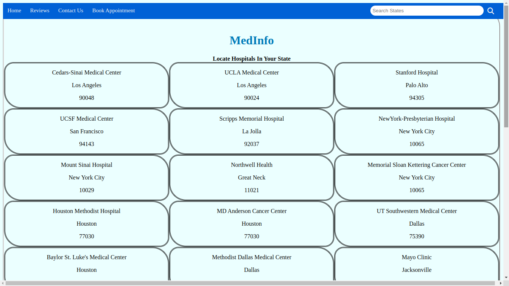

# MedInfo App

MedInfo is a web application designed to simplify the process of locating hospitals and booking appointments. With its user-friendly interface, users can easily search for hospitals in their desired state and access relevant information such as hospital names, locations, zip codes, and bed capacities.

## Features

*Hospital Search*: Users can input their desired state in the search bar to find hospitals within that state. The search results dynamically update as the user types, providing instant feedback.

*Hospital Listings*: The search results are displayed in a visually appealing format, presenting hospital details in a structured manner. Each hospital listing includes the name, location, zip code, and available bed capacity.

*Appointment Booking*: Users can click on the "Book" button associated with each hospital to initiate the appointment booking process. This opens a form where users can describe their emergency or medical needs and specify the urgency level of the appointment (urgent or minor).

*Reviews*: Users can navigate to the "Reviews" section, where they can leave feedback and reviews about their experiences with specific hospitals. This allows users to share their opinions and help others make informed decisions.

## Purpose

MedInfo aims to streamline the hospital search and appointment booking process, making it convenient for individuals to find healthcare facilities in their desired state. It provides a platform for users to access essential information, book appointments, and share their experiences, fostering transparency and aiding in informed decision-making.

Whether someone needs urgent medical attention or wants to leave a review for a previous hospital visit, MedInfo offers a comprehensive solution to meet these needs in a user-friendly manner.

## Conclusion

MedInfo is a valuable web application that simplifies the process of locating hospitals, booking appointments, and leaving reviews. Its intuitive design and seamless functionality make it a go-to resource for individuals seeking healthcare services. By providing easy access to vital information and fostering user engagement, MedInfo empowers users to make informed healthcare decisions.

